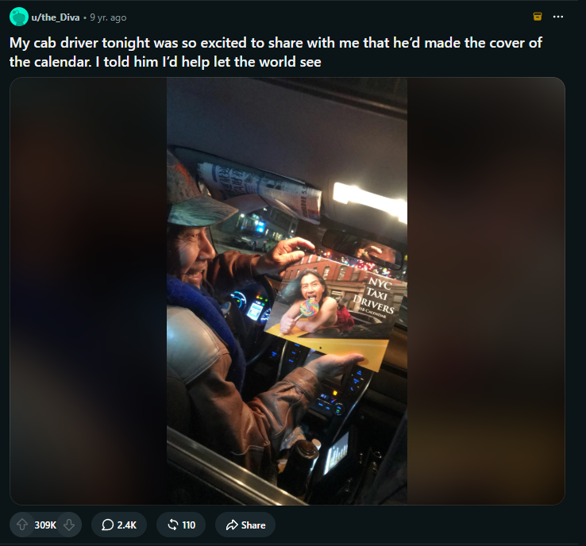

# Group Theme: Popularity Across Media and Culture

Our group is planning to study popularity across different types of media and culture. We want to see what makes specific cultural things to become popular, how that popularity develops and changes with time, and how different communities/platforms can influence what becomes more popular than something else. Our individual projects will look at these different questions by looking at different cultural areas - for example movies, music, social media, podcasts, etc.

One of our main ideas is that popularity doesn’t have one main definition, it can be very different based on the platform/medium - popularity can be represented through different things like ratings, views, sales, likes, engagement, rankings. However, we cannot say that these all represent the same thing. Also things can have a very select cultural following while not reaching the same mainstream success. For example, a movie could do well at the box office and have a large following later on, and then online social media creators can receive millions of views when they don’t have much of a following.

We want to look at investigating measurable indicators of popularity and cultural context that those measurements may leave out. We will mainly look at entertainment, media, etc. and will probably not look much at political popularity, consumer brands, etc. 

---

### Individual Project Ideas:

Aashi Agarwal - How movie popularity changes across audiences/platforms
I want to study how movie popularity changes based on the platform we are measuring it on. I want to compare Rotten Tomatoes and Letterboxd because they represent different rating systems and audiences.

For my custom dataset I want to collect 50-100 movies and include things like title, year, genre, and audience/critic reception. I will also try to get data on things that numerical ratings don’t show, such as how reviews look like (positive/negative/mixed) and aspects that reviewers look at like including acting, story, visuals, nostalgia, etc.

For the audit I will try to compare movies across Rotten Tomatoes and Letterboxd, and IMDb or box office data. I want to see if the movie seems equally “popular” across different platforms and what does each one of these platforms leave out. This connects to our theme of whether popularity can be represented by a single number.

Links: [Explanation of tomatometer](https://www.rottentomatoes.com/about), [Letterbox rating methodology](https://letterboxd.zendesk.com/hc/en-us/articles/15269023950223-How-is-the-average-rating-calculated-for-a-film),  [IMDb ratings dataset](https://data.imdb.com/non-commercial-datasets/)

Aidan Lueken - How the recent increase in TTRPG popularity has allowed them to be seen as effective means to help others in a more serious fashion than just gaming with friends. I would like to look at different uses of TTRPGs like Dungeons and Dragons that are being recently created in the medical fields of psychiatry and other forms of therapy. I would like to take a look at a number of studies and see the methods that they use to better improve the lives of those who use them for the purpose of treatment.

For my custom dataset, I would like to get a number of different sources using these games and log the type of treatment, the reason for using the game instead of something else, as well as the results of this treatment. I may also look at public perception of this form of treatment.

For the audit, I would like to look at comparing the popularity of different types of TTRPGs as this recent explosion in popularity has not been spread equally across the vast ocean of games. This shows the difference in popularity of different subtypes of a group, even if the larger group as a whole is being lifted.

Sara Johnson - I want to examine what kinds of content and creators become popular across different platforms. I’d like to examine around 50-100 of the top [TikTok](https://socialblade.com/tiktok/lists/top/100/followers), [Instagram](https://socialblade.com/instagram/lists/top/100/followers), and [Youtube](https://socialblade.com/youtube) accounts each to gauge metrics such as view counts, audience target, and what content they produce. I also am interested in exploring platforms such as Reddit and Pinterest. My goal with this research is to examine what types of content become popular across different platforms, and if medium (such as long-form vs. short-form) makes a difference to the type of content that is popular. 

By types of content, I'm looking to catagorize data across certain genres to find platform specific patterns. One example of the nuance I'm trying to target can be seen in both Reddit and Tiktok. [Reddit's top community](https://linkeddit.com/blog/largest-subreddits-2026) is r/funny, while Tiktok's most followed creator is Khaby Lame, a humor-based content creator.

Here is the top post from r/funny on Reddit.

One of Khaby Lame's top videos on Tiktok.

As you can see, there is a difference in humor between both pieces of media. There have been some studies done into the nuances of humor that I'd like to reference and attribute content across platforms to. For example, [this article](https://pubmed.ncbi.nlm.nih.gov/33342368/) does a great job of identifying different types of humor, and what makes things humorous.

The other types of content I'd like to explore too are topics such as food and fashion across platforms cross-referenced with platform demographics. For example in the food category, examining the #recipie tag on Instagram might yield similar or different content than #recipie on Tiktok or Youtube. For fashion, I'd like to see the differences in some of the top fashion tags, and how each platform's users identfy styles (for example streetwear, professional wear, and alternative styles). My goal is to perform these sub-analysis within the lists of top topics/accounts, so that popularity remains the defining exploration point of my data.

The exploration I'm performing differs from simply scraping top sites's webpages and compiling those results because they will not have the nuances of the categories I will introduce to the popular content categories. I will also be creating new datasets based on those popular accounts under the fields of humor, food, fashion, or any other additionally popular categories that I find as I explore this data.

For fashion, I'll be referring to some [modern lists of fashion styles](https://www.litlookzstudio.com/blogs/aesthetics/types-of-aesthetics?srsltid=AU7gw4XWCk6UMG3x-ARaSl5hMvAdVEfAZqlFDsnJ8-rX35M0ZfSLFvgM) for appropriate terminology, and attempting to define fields as I create my project.  

Overall, my part will tie into the core themes of popularity by examining what gets popular on platforms, and the reasons for popularity. It will also discover popular subcategories for different platform topics, and provide more data surrounding the subcultures found on internet platforms. This data will have most relevancy to the current year however, and I might try to see what can be done to extend the relevancy of my dataset for future research into these platforms and cultural topics. 

Aadam Pinnow - How much popular music is released independently versus from big labels. I would like to look through the Billboard Hot 100 over the past decade and examine what percentage are released independently. I could also look through the Billboard Artist 100 over the past decade and see what percentage are backed by major labels.

Jack Miller - For my project, I will explore trends within audio drama spaces, with a focus on themes such as independent creators, passion projects, marketability/monetization, and representation.  I am particularly interested in how a low barrier to entry correlates with representation, as well as interrogating how monetization of a creative work can affect the result.  

For this, I will likely be focusing on a few audio dramas as a set of case studies; currently I am leaning towards [Welcome to Night Vale](https://www.welcometonightvale.com/), [The Magnus Archives](https://rustyquill.com/show/the-magnus-archives/), [Camp Here and There](https://blue-wolfe.com/podcast/welcome-to-camp-here-there/), [Malevolent](https://www.malevolent.ca/), [Mercy: A Queer Eldritch Western](https://strangekindstudio.weebly.com/mercy.html), and [The Mechadova Engine](https://mechadovapod.com/).  Each of these audio dramas fills a different role with regards to what I could learn from it.  
WTNV started as an independent passion project and grew into its own brand, and TMA was produced and distributed through Rusty Quill - both of these are examples of audio dramas with monetary backing behind them (though in different ways and at different stages).  (Self indulgently, if it fits well, I may also bring [The Penumbra Podcast](https://www.thepenumbrapodcast.com/) in as a third example.)
CHNT and Malevolent are both fully funded through audience patronage, though Malevolent also runs ads.  Both of these are also fully independent projects, with CHNT being primarily headed by Blue Wolfe and hiring voice actors and other roles, and Malevolent being completely created by one person, Harlan Guthrie.  

Mercy and Mechadova both represent audio dramas from a small studio/creator respectively that are fully passion projects, with little to no funding.  Mercy has no Patreon or equivalent crowdfunding platform and runs no ads, and Mechadova is an up and coming audio drama that is fully crowdfunded.  I believe that Mechadova will provide an interesting look at audio dramas in their earliest stages, however, if there's not enough material to reference/study, I may swap it out for [Killjam XXX](https://linktr.ee/killjamxxx), which has essentially an identical financial situation as Mercy.  

(If it's relevant, I may also bring up the audio drama that I helped to create!  I was one of the team heads, and worked on concepting, editing and finalizing our script, voicing the main character, as well as all of the vocal+audio editing and soundscaping.  It was an incredible experience, both from a creative standpoint as well as giving me a strong understanding of what all goes into making an audio drama.  I'm also in several audio drama Discord servers, so if my project would be well served by it, I could potentially conduct interviews or surveys of fans and creators.)

For my custom dataset, I would likely use the above audio dramas to analyze the number of listens or reviews over time and the presence of ads, to see if there's a correlation between the two.  However, I would like to keep this flexible, in case I uncover a more compelling question in my research.  

For my audit, I would need to find an existing dataset of audio dramas to review.  There's currently an [ongoing data-gathering project](https://www.tumblr.com/augusttapes/826956543788548096/theres-no-data-on-representation-in-audio-drama) that I've got my eyes on, but as it's not complete, I won't commit to it yet. 

For my sources, I plan to do a mix of scholarly and popular sources.  For a topic like this, I believe that it would be beneficial to look at qualitative, lived experiences and opinions in addition to academic studies and analyses.  These are some of the potential scholarly sources I may reference:

- [Podcasting, Welcome to Night Vale, and the Revival of Radio Drama](https://doi.org/10.1080/19376529.2015.1083370)
- [The Rise and Power of Audio Storytelling in the 21st Century: A Critical Review](https://doi.org/10.36227/techrxiv.22697422.v1)
- [Where radio dare not tread: Podcasts as queer audio media](https://doi.org/10.1386/rjao_00073_1)
[A Structural and Content Analysis of Queer Characters and Themes in the Audio Drama EOS 10](https://scholarworks.seattleu.edu/suurj/vol9/iss1/15/)
- [Education, Community, Narrative Voices: The Internet as a Queer Storytelling Platform](https://jstor.org/stable/community.36514022)

---

### Scholarly Context 

Our projects will look at papers/literature about platforms, audiences, and “popular” culture, to help us think about how popularity can be measured. One helpful source would be The Platform Society (2018) by Jose Van Dijck, Thomas Poell, and Martijn de Waal. They look at how digital platforms can help organize cultural and social activity. This is useful because platforms are not really just neutral for recording popularity. Their structures, metrics, and way of organizing content can really influence how users understand cultural success.

This reading will help us differentiate between popularity as a cultural thing versus popularity as a metric. As our individual projects become more niche, we will find literature related to our media forms to help us make more informed decisions.

---

### Collaboration Plan

Our group plans to communicate mainly through iMessage group chat, and will also talk during class time or additional meetings for some of the main decisions. We will have each member be responsible for making and auditing their own datasets but we will share progress often, share sources, challenges, and any changes. We will try to peer review before any major milestones to connect to our main theme.

We will have a shared GitHub repository with labeled folders for each member’s datasets, their documentation, their code, and also have a folder for collective materials and the final website. We will make sure to have very detailed commits so that contributions and any changes stay very visible.

For the final website, we plan to have a shared landing page for our question of popularity across different media, and have separate pages for each individual project. We will try to have a similar structure across the content and pages so readers can easily compare popularity represented across different cultural forms. We will divide the website parts across different group members and review each other's pages before we submit.
